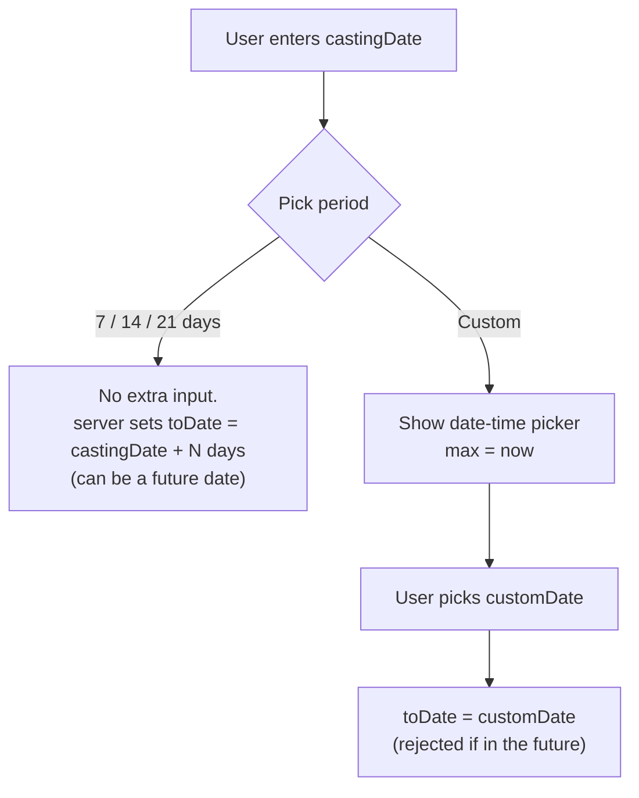

# Cube Testing — Frontend Integration Guide

Concrete cube tests logged against an order. An order can have **any number**
of cube tests — one per batch of cubes cast on site.

- **Base URL:** `{{base_url}}/api/v1/admin`
- **Auth:** every endpoint below requires `Authorization: Bearer <token>`
- Follows the same conventions as [ORDERS_AND_BILLING.md](./ORDERS_AND_BILLING.md) — response envelope, `422` validation errors, soft deletes. See that doc's [Conventions](./ORDERS_AND_BILLING.md#1-conventions) section if this is your first integration against this API.

---

## Contents

1. [The idea](#1-the-idea)
2. [Endpoints](#2-endpoints)
3. [Create / update fields](#3-create--update-fields)
4. [The period picker — UI logic](#4-the-period-picker--ui-logic)
5. [Cube test object shape](#5-cube-test-object-shape)
6. [File upload](#6-file-upload)
7. [Errors to handle](#7-errors-to-handle)
8. [Screen-by-screen call list](#8-screen-by-screen-call-list)

---

## 1. The idea

A cube test records:

- **`castingDate`** — when the concrete cube was cast (date **and** time).
- **`quantity`** — how much concrete that batch represents.
- **`period`** — which testing schedule applies: `SEVEN_DAYS`, `FOURTEEN_DAYS`, `TWENTYONE_DAYS`, or `CUSTOM`.
- **`fromDate`** / **`toDate`** — the testing window. `fromDate` is always the casting date. `toDate` depends on `period`:
  - Standard periods (`SEVEN_DAYS`/`FOURTEEN_DAYS`/`TWENTYONE_DAYS`): the server computes it as `castingDate + N days`. This is a **future** date — it's telling you when the test is due.
  - `CUSTOM`: **you** supply `toDate` as `customDate`. This is a **backdated record** of a test that already happened on a non-standard day, so the server rejects it with `400` if it's in the future.
- **`fileUrl`** — an optional photo or PDF of the test result/report.

There is no pass/fail result field — this is a scheduling and record-keeping feature, not a lab results system.

---

## 2. Endpoints

| | |
|---|---|
| `POST /orders/:orderId/cube-test` | Create a cube test |
| `GET /orders/:orderId/cube-test` | List all cube tests for the order, newest first |
| `GET /orders/:orderId/cube-test/:cubeTestId` | Get one |
| `PUT /orders/:orderId/cube-test/:cubeTestId` | Update — every field optional |
| `DELETE /orders/:orderId/cube-test/:cubeTestId` | Soft delete |

`:orderId` is the business id (`ORD-2026-0033`), not the internal row id. `:cubeTestId` is the row's own id (a cuid) — take it from the create response or the list.

**Create and update are `multipart/form-data`**, not JSON — the optional file travels in the same request as the text fields.

---

## 3. Create / update fields

| Field | Required on create | Notes |
|---|---|---|
| `castingDate` | ✅ | ISO date-time string, e.g. `2026-08-01T09:00:00.000Z` |
| `quantity` | ✅ | String, e.g. `"6"` or `"6 m3"` |
| `period` | ✅ | One of `SEVEN_DAYS`, `FOURTEEN_DAYS`, `TWENTYONE_DAYS`, `CUSTOM` |
| `customDate` | Only if `period = CUSTOM` | ISO date-time string. Must **not** be in the future |
| `file` | ❌ | Single file, `.pdf` / `.jpg` / `.jpeg` / `.png`, max 10MB |

On **update**, everything is optional — send only what changed. If you switch `period` to `CUSTOM` in an update, `customDate` becomes required in that same request (unless the row was already `CUSTOM` and you're just leaving it as-is).

Sending a new `file` on update **replaces** the old one — the previous file is deleted from disk.

---

## 4. The period picker — UI logic

This is the part product asked for explicitly, spelled out for the form:

1. User picks a period: **7 days / 14 days / 21 days / Custom**.
2. **If 7/14/21 is picked:** don't show a date picker for the test date at all — the server computes it. You can preview it client-side as `castingDate + N days` if you want to show the user the scheduled test date immediately, but always let the server's returned `toDate` be the source of truth.
3. **If Custom is picked:** show a date-time picker for `customDate`. Restrict it to **today or earlier** — no future dates. (The server also enforces this, so treat the client-side restriction as UX sugar, not the real guard — always handle the `400` below.)
4. `castingDate` is always entered by the user regardless of period — it's a separate field, not derived from anything.



---

## 5. Cube test object shape

Returned by create, get, list and update:

```json
{
  "id": "cms9x49sy0001t5vcd16onzpo",
  "orderId": "cmr3swjf4000dktcgib1pdt6l",
  "castingDate": "2026-08-01T09:00:00.000Z",
  "quantity": "6",
  "period": "FOURTEEN_DAYS",
  "fromDate": "2026-08-01T09:00:00.000Z",
  "toDate": "2026-08-15T09:00:00.000Z",
  "fileUrl": "/uploads/cube-tests/ORD-2026-0033/report-1735689600000-123456789.pdf",
  "createdAt": "2026-08-01T09:05:00.000Z",
  "updatedAt": "2026-08-01T09:05:00.000Z",
  "isDeleted": false
}
```

Note `orderId` here is the **internal** id, not the `ORD-…` code — the object doesn't carry the order's business id back. If the list screen needs to show it, you already have it (you called the endpoint with it in the URL).

List response wraps this in the usual envelope, as a plain array (no pagination):

```json
{ "success": true, "data": [ /* cube test objects, newest first */ ] }
```

---

## 6. File upload

Same mechanics as bill/challan uploads elsewhere in this API:

- `multipart/form-data`, **one file**, field name **`file`**
- Allowed: `.pdf`, `.jpg`, `.jpeg`, `.png`
- Max **10MB**
- **Do not set `Content-Type` yourself** — let the browser/`FormData` set the multipart boundary

```js
const body = new FormData();
body.append('castingDate', castingDate.toISOString());
body.append('quantity', quantity);
body.append('period', period); // e.g. 'CUSTOM'
if (period === 'CUSTOM') body.append('customDate', customDate.toISOString());
if (file) body.append('file', file);

await fetch(`${BASE}/orders/${orderId}/cube-test`, {
  method: 'POST',
  headers: { Authorization: `Bearer ${token}` }, // no Content-Type
  body,
});
```

Display an attached file the same way as elsewhere: prefix `fileUrl` with the API origin.

```jsx
<a href={`${ORIGIN}${cubeTest.fileUrl}`} target="_blank">View report</a>
```

> Uploaded files are served by static hosting and are **not** behind the auth check — anyone with the URL can open it. Filenames carry a random suffix, so they aren't guessable, but don't treat these URLs as secret.

---

## 7. Errors to handle

| Code | When | Show the user |
|---|---|---|
| `400` | `customDate` is in the future | `message` verbatim: `"Custom date cannot be a future date"` |
| `404` | Order or cube test not found (wrong id, wrong order, or already deleted) | — |
| `422` | Missing/invalid field — `errors` keyed by field name, e.g. `{ "customDate": ["The custom date field is required when period is CUSTOM."] }` | Map onto form fields |

A rejected file upload (wrong type/too large) comes back as `{ "error": "Only .png, .jpg, .jpeg and .pdf files are allowed!" }` from multer, not the usual envelope — check for `error` as well as `success: false` when handling the create/update response.

---

## 8. Screen-by-screen call list

| Screen | Call |
|---|---|
| Order detail → "Cube Tests" tab | `GET /orders/:orderId/cube-test` on load |
| "+ Add cube test" | Form → `POST /orders/:orderId/cube-test` |
| Cube test row → "Edit" | Prefill from the row already in memory, `PUT` only the changed fields |
| Cube test row → "Delete" | Confirm, then `DELETE /orders/:orderId/cube-test/:cubeTestId`, remove from list on success |
| Cube test row → "View report" | `<a href="{ORIGIN}{fileUrl}">` if `fileUrl` is set, else show "+ Add report" that reuses the edit form with just a file |
