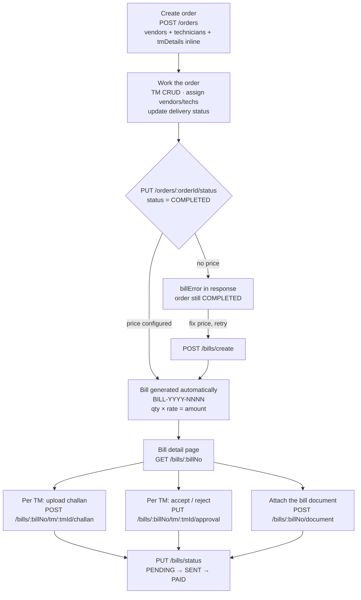

# Orders & Billing — Frontend Integration Guide

Everything the admin panel needs to drive an order from creation to a paid bill.

- **Base URL:** `{{base_url}}/api/v1/admin`
- **Auth:** every endpoint below requires `Authorization: Bearer <token>`
- **Postman:** `Shivesh.postman_collection.json` (folders **Orders** and **Bills**) mirrors this document

---

## Contents

1. [Conventions](#1-conventions)
2. [The flow at a glance](#2-the-flow-at-a-glance)
3. [Orders](#3-orders)
4. [TM details](#4-tm-details)
5. [Billing](#5-billing)
6. [File uploads](#6-file-uploads)
7. [Enums](#7-enums)
8. [Screen-by-screen call list](#8-screen-by-screen-call-list)
9. [End-to-end test walkthrough](#9-end-to-end-test-walkthrough)

---

## 1. Conventions

### Auth

`POST /api/v1/admin/auth` with `{ "userName", "password" }` returns:

```json
{ "success": true, "message": "User logged in successfully",
  "data": { "id": 1, "name": "…", "userName": "…", "role": "ADMIN",
            "employeeId": "…", "token": "<encrypted JWT>" } }
```

Send it back as `Authorization: Bearer <token>` on every request. Tokens last 30 days.

> `GET /api/v1/admin/token` mints a throwaway admin token for local testing — dev only.

### Response envelope

Success:

```json
{ "success": true, "message": "…", "data": { } }
```

Lists add pagination alongside `data`:

```json
{ "success": true, "data": [ ], "total": 42, "page": 1 }
```

Failure:

```json
{ "success": false, "message": "Human-readable reason" }
```

### Status codes

| Code | Meaning | Show the user |
|---|---|---|
| `400` | Bad input, or an action the current state doesn't allow | `message` verbatim — it explains why |
| `401` / `403` | Token missing, invalid or expired | Bounce to login |
| `404` | Entity not found | — |
| `409` | Conflict — duplicate, or a locked record | `message` verbatim |
| `422` | Field validation failed. Adds an `errors` object keyed by field | Map onto form fields |
| `500` | Server error | Generic message |

A `422` body:

```json
{ "success": false, "message": "Validation failed",
  "errors": { "truckNo": ["The truckNo field is required."] } }
```

### Identifiers

Use **business ids** in URLs and bodies, never the internal `id`:

| Entity | Looks like |
|---|---|
| Order | `ORD-2026-0014` |
| Bill | `BILL-2026-0004` |
| Project | `PRJ-2026-0019` |
| Client | `CL-2025-0004` |

Exceptions — these take a row `id` (a cuid) because there's no business id: `tmId`, `orderVendorId`, `orderTechnicianId`. Vendors, vendor locations, handlers and users are plain integers.

Deletes are **soft** everywhere (`isDeleted`), so nothing disappears from the database.

---

## 2. The flow at a glance



**The two rules that matter:**

1. **Completing an order bills it.** There is no separate "generate bill" step in the happy path.
2. **TMs never affect the amount.** The bill is `order.quantity × rate`. TMs are delivery records shown on the bill; rejecting one does not reduce what's billed.

---

## 3. Orders

### List

`GET /orders`

| Query param | Notes |
|---|---|
| `page`, `limit` | Default `1` / `20` |
| `status` | An `OrderStatus`. **Omitting it hides COMPLETED orders** — pass `status=COMPLETED` for the completed tab |
| `clientId` | e.g. `CL-2025-0004` |
| `assignedToId` | Numeric user id of an assigned technician |
| `search` | Matches order id, product name, project name |
| `includeDeleted` | `true` also returns soft-deleted orders, each carrying `isDeleted: true` |

Each row carries `project`, `client`, `vendors[]`, `technicians[]` and `_count: { tmDetails, comments }` — enough for a list view without a second call.

### Create

`POST /orders`

```json
{
  "projectId": "PRJ-2026-0019",
  "clientId": "CL-2025-0004",
  "productName": "RMC-NEW",
  "productGrade": "M10",
  "quantity": "12",
  "deliveryAddress": "Kalpataru Immensa, Thane West",
  "date": "2026-09-01",
  "time": "10:30 AM",
  "vendors": [{ "vendorId": 1, "vendorLocationId": 36, "vendorHandlerId": 45 }],
  "technicians": [{ "userId": 38 }],
  "tmDetails": [
    { "truckNo": "MH 01 4756", "qty": "6 m3", "dispatchTime": "09:30 AM",
      "arrivalTime": "09:55 AM", "batchStartTime": "10:00 AM",
      "batchEndTime": "12:00 PM", "challanNo": "284897593" }
  ]
}
```

**Required:** `projectId`, `clientId`, `productName`, `productGrade`, `quantity`.
Everything else is optional; the three arrays default to empty.

- `quantity` is a **string** and drives the bill — keep it numeric-looking (`"12"`, or `"12 m3"`). It must parse as a positive number or billing fails later.
- `vendors[]` — `vendorId` required. A handler must belong to the given location, and the location to the vendor, or you get a 404 naming the mismatch.
- `technicians[]` — `[{ "userId": 38 }]` or plain `[38]`. Each must be an active `FIELD_TECHNICIAN`; get the list from `GET /orders/field-techs`.
- `tmDetails[]` — each needs only `truckNo` and `qty`. Numbered `TM 01`, `TM 02` … by array position.

Everything is validated **before** anything is written, so a bad entry never leaves a half-built order. Returns `201` with the full order.

### Read / update / delete

| | |
|---|---|
| `GET /orders/:orderId` | Full order: `project`, `client`, `vendors[]`, `technicians[]`, `tmDetails[]`, `comments[]`. Supports `?includeDeleted=true` |
| `PUT /orders/:orderId` | Summary only — `productName`, `productGrade`, `quantity`, `deliveryAddress`, `date`, `time`. All optional |
| `DELETE /orders/:orderId` | Soft delete |
| `POST /orders/:orderId/comments` | `{ "message": "…" }` — posted as `ADMIN`, notifies client + technicians |

Project, client, vendors and technicians are **not** editable through `PUT /orders/:orderId` — use their own endpoints.

### Status — the billing trigger

`PUT /orders/:orderId/status`

```json
{ "status": "COMPLETED", "deliveryStatus": "COMPLETED" }
```

At least one of the two is required. They are **independent** — setting `status` does not move `deliveryStatus`. Send both if you want both to change.

Setting `status: "COMPLETED"` generates the bill:

```json
{ "success": true, "message": "Order status updated",
  "data": { },
  "bill": { "billNo": "BILL-2026-0004", "quantity": 12, "rate": 800,
            "amount": 9600, "status": "PENDING" } }
```

If billing can't run, the status change **still succeeds** and you get a warning instead:

```json
{ "success": true, "message": "Order status updated",
  "data": { },
  "billError": "No price configured for RMC-NEW M10 on this project — pass an explicit rate" }
```

> **Frontend:** always check for `bill` and `billError` on this response. On `billError`, surface it and offer "Generate bill manually" → `POST /bills/create` with an explicit `rate`.

Billing only fires when `status` becomes `COMPLETED` and the order wasn't already `COMPLETED`, so repeated calls won't double-bill.

### Vendors and technicians

These follow an older convention — **create and update take the ids in the body**, list and delete take them in the path.

| | |
|---|---|
| `POST /orders/vendor/create` | `{ orderId, vendorId, vendorLocationId?, vendorHandlerId? }` |
| `GET /orders/:orderId/vendor/list` | |
| `PUT /orders/vendor` | `{ orderVendorId, orderId, vendorId?, vendorLocationId?, vendorHandlerId? }` |
| `DELETE /orders/:orderId/vendor/:orderVendorId` | |
| `POST /orders/technician/create` | `{ orderId, userId }` |
| `GET /orders/:orderId/technician/list` | |
| `PUT /orders/technician` | `{ orderTechnicianId, orderId, userId }` |
| `DELETE /orders/:orderId/technician/:orderTechnicianId` | |
| `GET /orders/field-techs` | All active field technicians — populate the assign dropdown |

The same vendor may appear twice from **different plants**; repeating the exact vendor + location pair gives `409`. Assigning the same technician twice gives `409`.

---

## 4. TM details

Transit mixers are **delivery tracking**. Orders own their CRUD; the challan file and the accept/reject live on the bill (section 5).

| | |
|---|---|
| `POST /orders/:orderId/tm` | Add a TM |
| `GET /orders/:orderId/tm` | List, oldest first |
| `PUT /orders/:orderId/tm/:tmId` | Update |
| `DELETE /orders/:orderId/tm/:tmId` | Soft delete |

```json
{
  "truckNo": "MH 01 9999",
  "qty": "4 m3",
  "dispatchTime": "01:00 PM",
  "arrivalTime": "01:20 PM",
  "batchStartTime": "01:30 PM",
  "batchEndTime": "02:30 PM",
  "challanNo": "284997594",
  "status": "ASSIGNED"
}
```

**Only `truckNo` and `qty` are required.** Everything else can be filled in later — a TM can be planned when the order is created and completed as the truck actually runs. On update, every field is optional; send `null` to clear a timing or challan number.

All times are **free-text strings** (`"01:00 PM"`), not timestamps. Format them however the design wants.

Server-owned, not settable here:

| Field | Set by |
|---|---|
| `tmNumber` | Generated per order (`TM 01`, `TM 02` …). Deleted numbers are never reused |
| `challanUrl` | The challan upload on the bill |
| `approvalStatus`, `rejectionReason`, `approvedAt` | The approval endpoint on the bill |

---

## 5. Billing

### How a bill is calculated

```
quantity = order.quantity            parsed as a number ("12 m3" → 12)
rate     = ProjectProduct.costPrice  for that project + productName + productGrade
           (or an explicit `rate` in the request, which wins)
amount   = quantity × rate
```

If no `ProjectProduct` price exists for that exact product **and** grade, generation fails with a `400` telling you to pass a rate. This is the single most common billing failure — make sure the project has pricing configured.

### Endpoints

| | |
|---|---|
| `GET /bills/list` | `page`, `limit`, `status`, `clientId`, `search` |
| `GET /bills/:billNo` | Full bill page payload |
| `GET /bills/order/:orderId` | Same payload, looked up by order. `404` if not billed yet |
| `POST /bills/create` | Manual fallback — `{ orderId, rate?, dueDate? }` |
| `PUT /bills` | `{ billNo, rate?, dueDate?, recalculate? }` |
| `PUT /bills/status` | `{ billNo, status }` |
| `DELETE /bills/:billNo` | Soft delete |
| `POST /bills/:billNo/document` | Upload the bill PDF/image |
| `POST /bills/:billNo/tm/:tmId/challan` | Upload a TM's challan |
| `PUT /bills/:billNo/tm/:tmId/approval` | Accept / reject a TM |

`POST /bills/create` returns `400` unless the order is `COMPLETED`, and `409` if it already has a bill.
`PUT /bills` with `"recalculate": true` re-reads the order's quantity.

### Bill page payload

`GET /bills/:billNo` returns everything the bill detail screen renders:

```json
{
  "billNo": "BILL-2026-0004",
  "status": "PENDING",
  "issueDate": "2026-07-31T13:04:55.000Z",
  "dueDate": null,
  "paidAt": null,
  "documentUrl": "/uploads/bills/BILL-2026-0004/scan-….pdf",

  "billDetails": {
    "product": "RMC-NEW", "grade": "M10", "quantity": 12,
    "clientName": "Curl Test Company", "site": "Kalpataru Immensa",
    "contactNo": "9876543212", "orderNo": "ORD-2026-0014",
    "vendorName": "Acme Industries",
    "vendors": [{ "id": "…", "vendorId": 1, "companyName": "Acme Industries", "plantName": "Kalpataru" }],
    "date": "2026-09-01", "rate": 800, "amount": 9600
  },

  "fieldTechnicians": [
    { "id": "…", "name": "Mobiletesting", "contactNo": "8779392536", "employeeId": "EMP1000" }
  ],

  "tmDetails": [
    { "id": "cms…", "tmNumber": "TM 01", "truckNo": "MH 01 4756", "qty": "6 m3",
      "dispatchTime": "09:30 AM", "arrivalTime": "09:55 AM",
      "batchStartTime": "10:00 AM", "batchEndTime": "12:00 PM",
      "challanNo": "284897593",
      "challanUrl": "/uploads/challans/BILL-2026-0004/challan-….pdf",
      "status": "ASSIGNED", "approvalStatus": "ACCEPTED",
      "rejectionReason": null, "approvedAt": "2026-07-31T13:05:00.000Z" }
  ],

  "activityLog": [
    { "id": "…", "title": "Bill generated", "description": "…",
      "action": "CREATED", "createdAt": "…", "createdBy": "Admin" }
  ]
}
```

Rendering notes:

- `amount` and `rate` are **raw numbers** — currency symbol and grouping are yours.
- `quantity` is numeric, so any unit typed into the order (`"12 m3"`) is stripped. Render the unit yourself if the design needs it.
- `vendorName` is a comma-joined string for multiple vendors; `vendors[]` beside it has them individually.
- `fieldTechnicians` is an **array** — an order can have several, or none.
- `tmDetails[].challanUrl` is `null` until a challan is uploaded → that's your **+ Add challan** vs **View challan** toggle.

### TM review, on the bill

**Upload a challan** — `POST /bills/:billNo/tm/:tmId/challan`, `multipart/form-data`, file field **`challan`**. Sets `challanUrl`. Re-uploading replaces the reference.

**Accept / reject** — `PUT /bills/:billNo/tm/:tmId/approval`

```json
{ "approvalStatus": "REJECTED", "rejectionReason": "Slump test failed on arrival" }
```

`rejectionReason` is required and must be non-blank when rejecting (`400` otherwise), and is cleared on any other status. `approvedAt` is stamped on `ACCEPTED`.

> Rejecting a TM is a **record only** — the billed amount does not change.

`tmId` comes from `tmDetails[].id` in the payload above.

### Bill status

`PUT /bills/status` moves `PENDING → SENT → PAID` (or `OVERDUE` / `CANCELLED`).

- `paidAt` is stamped the first time it becomes `PAID`, and cleared if it moves back out.
- `SENT`, `PAID` and `OVERDUE` notify the client.
- **`PAID` and `CANCELLED` lock the bill:** `PUT /bills` returns `409`, and `DELETE` refuses a `PAID` bill — cancel it instead.

> **Frontend:** hide or disable Edit and Delete when `status` is `PAID` or `CANCELLED`.

---

## 6. File uploads

Two upload endpoints, same mechanics:

| Purpose | Endpoint | Field name |
|---|---|---|
| Bill document | `POST /bills/:billNo/document` | `document` |
| TM challan | `POST /bills/:billNo/tm/:tmId/challan` | `challan` |

- `multipart/form-data`, **one file**
- Allowed: `.pdf`, `.jpg`, `.jpeg`, `.png` — checked on both extension and mimetype
- Max **10 MB**
- **Do not set `Content-Type` yourself.** Let the browser/`FormData` set the multipart boundary — a hand-set `application/json` is the usual cause of "No file uploaded"

```js
const body = new FormData();
body.append('challan', file);

await fetch(`${BASE}/bills/${billNo}/tm/${tmId}/challan`, {
  method: 'POST',
  headers: { Authorization: `Bearer ${token}` },   // no Content-Type
  body,
});
```

The response carries the stored path (`documentUrl` / `challanUrl`). Prefix it with the API origin to display it:

```js
<a href={`${ORIGIN}${tm.challanUrl}`} target="_blank">View challan</a>
```

Rejected files come back as `{ "error": "Only .png, .jpg, .jpeg and .pdf files are allowed!" }`.

> **Note:** uploaded files are served by static hosting and are **not** behind the auth check — anyone with the URL can open it. Filenames carry a random suffix, so they aren't guessable, but don't treat these URLs as secret.

---

## 7. Enums

```ts
type OrderStatus    = 'NEW' | 'CONFIRMED' | 'IN_PROGRESS' | 'DELIVERED' | 'COMPLETED' | 'CANCELLED';
type DeliveryStatus = 'ASSIGNED' | 'IN_TRANSIT' | 'DELIVERED' | 'COMPLETED';
type TmStatus       = DeliveryStatus;                                  // where the truck is
type TmApproval     = 'PENDING' | 'ACCEPTED' | 'REJECTED';             // review on the bill
type BillStatus     = 'PENDING' | 'SENT' | 'PAID' | 'OVERDUE' | 'CANCELLED';
```

New orders start at `status: NEW`, `deliveryStatus: ASSIGNED`.
New TMs start at `status: ASSIGNED`, `approvalStatus: PENDING`.
New bills start at `status: PENDING`.

---

## 8. Screen-by-screen call list

### Orders list

```
GET /orders?page=1&limit=20&status=&search=
GET /orders?status=COMPLETED          ← completed tab (the default hides them)
```

### Create order

```
GET  /project/list                    populate project dropdown
GET  /client                          populate client dropdown
GET  /vendor                          + locations/handlers per vendor
GET  /orders/field-techs              technician dropdown
POST /orders                          one call, TMs included
```

### Order detail

```
GET    /orders/:orderId
PUT    /orders/:orderId               edit summary
PUT    /orders/:orderId/status        ← returns `bill` when set to COMPLETED
POST   /orders/:orderId/tm            add TM
PUT    /orders/:orderId/tm/:tmId      edit TM
DELETE /orders/:orderId/tm/:tmId      remove TM
POST   /orders/vendor/create          add vendor
POST   /orders/technician/create      assign technician
POST   /orders/:orderId/comments      comment
```

### Bills list

```
GET /bills/list?page=1&limit=20&status=&search=
```

### Bill detail

```
GET  /bills/:billNo                            everything on the page
POST /bills/:billNo/tm/:tmId/challan           + Add challan (per TM)
PUT  /bills/:billNo/tm/:tmId/approval          Accept / Reject (per TM)
POST /bills/:billNo/document                   attach the bill PDF/image
PUT  /bills                                    edit rate / due date
PUT  /bills/status                             mark SENT / PAID
```

Open a challan or the bill document at `${ORIGIN}${url}` from `challanUrl` / `documentUrl`.

---

## Not built yet

- **Download Bill PDF** — no endpoint exists. Either render client-side from the bill payload, or ask for a server-side generator (the backend has no PDF library today).
- **Edit quantity** on the bill page — `PUT /bills` changes `rate` and `dueDate`, and `recalculate: true` re-reads the order quantity, but there is no endpoint that sets a bill quantity directly.
- **Multiple documents per bill** — `documentUrl` is a single field, so a second upload replaces the first.

---

## 9. End-to-end test walkthrough

Copy-paste `curl` for the whole lifecycle, in order. Every id below is **real data on the dev DB** at the time of writing — swap in your own if it has since changed (`GET /project/list`, `GET /client`, `GET /vendor` to look up current ones).

```bash
BASE="http://localhost:3001/api/v1/admin"

# Dev-only helper that mints a working admin token without logging in.
# For real testing use POST $BASE/auth with a real userName/password instead.
TOKEN=$(curl -s "$BASE/token" | python3 -c "import sys,json;print(json.load(sys.stdin)['data']['token'])")
AUTH="Authorization: Bearer $TOKEN"
```

### Step 1 — Create an order with two TMs inline

Project `PRJ-2026-0019` has a configured price for `RMC-NEW` / `M10` (₹800), so billing will resolve its own rate later with no extra input.

```bash
curl -s -X POST "$BASE/orders" -H "$AUTH" -H "Content-Type: application/json" -d '{
  "projectId": "PRJ-2026-0019",
  "clientId": "CL-2025-0004",
  "productName": "RMC-NEW",
  "productGrade": "M10",
  "quantity": "12",
  "deliveryAddress": "Kalpataru Immensa, Thane West, Mumbai - 400607",
  "date": "2026-09-01",
  "time": "10:30 AM",
  "vendors": [
    { "vendorId": 1, "vendorLocationId": 36, "vendorHandlerId": 45 }
  ],
  "technicians": [
    { "userId": 38 }
  ],
  "tmDetails": [
    { "truckNo": "MH 01 4756", "qty": "6 m3",
      "dispatchTime": "09:30 AM", "arrivalTime": "09:55 AM",
      "batchStartTime": "10:00 AM", "batchEndTime": "12:00 PM",
      "challanNo": "284897593" },
    { "truckNo": "MH 01 4758", "qty": "6 m3",
      "dispatchTime": "11:30 AM", "arrivalTime": "11:50 AM",
      "batchStartTime": "10:00 AM", "batchEndTime": "12:00 PM",
      "challanNo": "284997593" }
  ]
}' | python3 -m json.tool
```

Note the returned `data.orderId` (e.g. `ORD-2026-0015`) — every step below uses it. Save it:

```bash
ORDER_ID="ORD-2026-0015"   # ← replace with what you got back
```

### Step 2 — Read the order back

```bash
curl -s "$BASE/orders/$ORDER_ID" -H "$AUTH" | python3 -m json.tool
```

Confirm `data.tmDetails` has both TMs, `data.vendors` has Acme Industries / Kalpataru, `data.technicians` has Mobiletesting.

### Step 3 — Add a third TM after the fact (minimum fields only)

```bash
TM3=$(curl -s -X POST "$BASE/orders/$ORDER_ID/tm" -H "$AUTH" -H "Content-Type: application/json" -d '{
  "truckNo": "MH 01 9999",
  "qty": "4 m3"
}')
echo "$TM3" | python3 -m json.tool
TM3_ID=$(echo "$TM3" | python3 -c "import sys,json;print(json.load(sys.stdin)['data']['id'])")
```

`batchStartTime`, `batchEndTime` and `challanNo` come back `null` — that's expected, fill them in next.

### Step 4 — Fill in that TM's timings once the truck runs

```bash
curl -s -X PUT "$BASE/orders/$ORDER_ID/tm/$TM3_ID" -H "$AUTH" -H "Content-Type: application/json" -d '{
  "dispatchTime": "01:00 PM",
  "arrivalTime": "01:20 PM",
  "batchStartTime": "01:30 PM",
  "batchEndTime": "02:30 PM",
  "challanNo": "284997594",
  "status": "DELIVERED"
}' | python3 -m json.tool
```

### Step 5 — Update delivery/order status as the order progresses

```bash
curl -s -X PUT "$BASE/orders/$ORDER_ID/status" -H "$AUTH" -H "Content-Type: application/json" -d '{
  "status": "IN_PROGRESS",
  "deliveryStatus": "IN_TRANSIT"
}' | python3 -m json.tool
```

No `bill` or `billError` in the response yet — only `COMPLETED` triggers billing.

### Step 6 — Complete the order → bill is generated automatically

```bash
curl -s -X PUT "$BASE/orders/$ORDER_ID/status" -H "$AUTH" -H "Content-Type: application/json" -d '{
  "status": "COMPLETED",
  "deliveryStatus": "COMPLETED"
}' | python3 -m json.tool
```

Expect a `bill` object in the response:

```json
{
  "success": true,
  "message": "Order status updated",
  "data": { "status": "COMPLETED", "deliveryStatus": "COMPLETED", "…": "…" },
  "bill": { "billNo": "BILL-2026-0005", "quantity": 12, "rate": 800, "amount": 9600, "status": "PENDING" }
}
```

Save the bill number:

```bash
BILL_NO="BILL-2026-0005"   # ← replace with what you got back
```

**To see the `billError` path:** create a second order on a product/grade with no `ProjectProduct` price (or omit `productGrade` pricing entirely), complete it, and confirm the response has `billError` instead of `bill`, and no bill was created. Then:

```bash
curl -s -X POST "$BASE/bills/create" -H "$AUTH" -H "Content-Type: application/json" -d '{
  "orderId": "'"$ORDER_ID"'",
  "rate": 850,
  "dueDate": "2026-09-30"
}' | python3 -m json.tool
```

### Step 7 — Open the bill detail page

```bash
curl -s "$BASE/bills/$BILL_NO" -H "$AUTH" | python3 -m json.tool
```

Grab a TM id from the response's `tmDetails[]` for the next two steps:

```bash
TM_ID=$(curl -s "$BASE/bills/$BILL_NO" -H "$AUTH" | python3 -c "import sys,json;print(json.load(sys.stdin)['data']['tmDetails'][0]['id'])")
```

### Step 8 — Upload a challan against that TM

```bash
curl -s -X POST "$BASE/bills/$BILL_NO/tm/$TM_ID/challan" -H "$AUTH" \
  -F "challan=@test-cases/sample-uploads/sample-bill.pdf" | python3 -m json.tool
```

Fetch it back (no auth needed — it's a static file):

```bash
CHALLAN_URL=$(curl -s "$BASE/bills/$BILL_NO" -H "$AUTH" | python3 -c "import sys,json;print(json.load(sys.stdin)['data']['tmDetails'][0]['challanUrl'])")
curl -s -o /dev/null -w "%{http_code} %{content_type}\n" "http://localhost:3001$CHALLAN_URL"
```

### Step 9 — Accept one TM, reject another with a reason

```bash
# Accept
curl -s -X PUT "$BASE/bills/$BILL_NO/tm/$TM_ID/approval" -H "$AUTH" -H "Content-Type: application/json" -d '{
  "approvalStatus": "ACCEPTED"
}' | python3 -m json.tool

# Reject (reason required)
SECOND_TM_ID=$(curl -s "$BASE/bills/$BILL_NO" -H "$AUTH" | python3 -c "import sys,json;print(json.load(sys.stdin)['data']['tmDetails'][1]['id'])")
curl -s -X PUT "$BASE/bills/$BILL_NO/tm/$SECOND_TM_ID/approval" -H "$AUTH" -H "Content-Type: application/json" -d '{
  "approvalStatus": "REJECTED",
  "rejectionReason": "Slump test failed on arrival"
}' | python3 -m json.tool

# Confirm rejecting did NOT change the bill amount
curl -s "$BASE/bills/$BILL_NO" -H "$AUTH" | python3 -c "import sys,json;print(json.load(sys.stdin)['data']['billDetails']['amount'])"
```

### Step 10 — Attach the bill's own document

```bash
curl -s -X POST "$BASE/bills/$BILL_NO/document" -H "$AUTH" \
  -F "document=@test-cases/sample-uploads/sample-bill-scan.png" | python3 -m json.tool
```

### Step 11 — Edit the bill (rate override + recalculate)

```bash
curl -s -X PUT "$BASE/bills" -H "$AUTH" -H "Content-Type: application/json" -d '{
  "billNo": "'"$BILL_NO"'",
  "rate": 950,
  "recalculate": true,
  "dueDate": "2026-09-30"
}' | python3 -m json.tool
```

### Step 12 — Move the bill through its status

```bash
curl -s -X PUT "$BASE/bills/status" -H "$AUTH" -H "Content-Type: application/json" -d '{
  "billNo": "'"$BILL_NO"'",
  "status": "SENT"
}' | python3 -m json.tool

curl -s -X PUT "$BASE/bills/status" -H "$AUTH" -H "Content-Type: application/json" -d '{
  "billNo": "'"$BILL_NO"'",
  "status": "PAID"
}' | python3 -m json.tool
```

Confirm `paidAt` is now set, then confirm the bill is locked:

```bash
# Both of these should now fail
curl -s -o /dev/null -w "PUT /bills (edit locked bill)   -> %{http_code}\n" -X PUT "$BASE/bills" -H "$AUTH" -H "Content-Type: application/json" -d '{"billNo":"'"$BILL_NO"'","rate":1000}'
curl -s -o /dev/null -w "DELETE paid bill                -> %{http_code}\n" -X DELETE "$BASE/bills/$BILL_NO" -H "$AUTH"
```

Expect `409` on both.

### Reference data used above

Pull current values any time with these (swap into the requests if the dev DB has changed):

```bash
# Projects + client + configured pricing
curl -s "$BASE/project/list?page=1&limit=5" -H "$AUTH" | python3 -m json.tool

# Vendors + their locations + handlers
curl -s "$BASE/vendor?page=1&limit=5" -H "$AUTH" | python3 -m json.tool

# Field technicians available to assign
curl -s "$BASE/orders/field-techs" -H "$AUTH" | python3 -m json.tool
```

As of writing:

| | |
|---|---|
| Project with `RMC-NEW`/`M10` priced at ₹800 | `PRJ-2026-0019` (client `CL-2025-0004`) |
| Vendor / location / handler that line up | vendor `1` → location `36` (Kalpataru) → handler `45` |
| Active field technician (has a phone, for mobile testing too) | user `38`, Mobiletesting |

### Full sanity checklist

Run through in order and confirm each:

- [ ] Order created with 2 inline TMs → `201`, both TMs present
- [ ] 3rd TM added with only `truckNo`+`qty` → other fields `null`
- [ ] That TM updated with timings + challan no → fields populated
- [ ] Status → `IN_PROGRESS` → no `bill` in response
- [ ] Status → `COMPLETED` → `bill` present, `amount = quantity × rate`
- [ ] Re-completing the same order / `POST /bills/create` on it → `409` (already billed)
- [ ] Challan upload on a TM → `200`, file fetchable at `challanUrl`
- [ ] TM rejected with no `rejectionReason` → `400`
- [ ] TM rejected with a reason → bill `amount` **unchanged**
- [ ] Bill document upload → `200`, fetchable at `documentUrl`
- [ ] Bill status → `SENT` → client notification created
- [ ] Bill status → `PAID` → `paidAt` set
- [ ] Edit / delete on the now-`PAID` bill → both `409`
